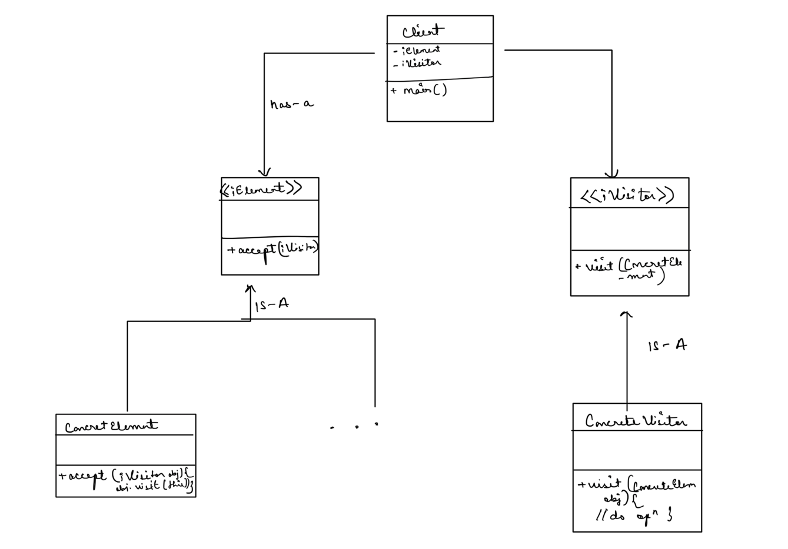

## Definition / use

- It allows the developer to separate the object and the operations to be performed on that object.
- Key Idea: Separate the key element (Element interface and ConcreteElement classes) and operations on it (Visitor interface, with concrete operations as VisitorImpl)
- The key player over here is double dispatch
  - When a method call is dependent upon two objects. In this case, visitor and element object.

## When to use ?

- When the object involves complex or composite structures.
    - Commonly used in compilers, to handle different node types in an AST, without cluttering the node classes with many un-related operations. These operations include evaluation, optimisation, code generation etc.
- Adding operations to a stable class hierarchy.
    - If a class hierarchy is in place. Example: Language -> CobolLanguage, JavaLanguage
    - And there are new operations to be added.
        - I need to actually apply and compare the two codes (with and without the visitor pattern, solving the same problem)
        - Then, it will be clear what are the problems in the pre-visitor case, and how is it solved gracefully.
        - At which point one should think for visitor and not just basic class and attributes.
- A key point around "when to use this pattern", when multiple children classes or composite structures of a class are present, and there are several operations to be performed on them.
  - Picture this, every time a new operation comes, that has to be added to all the 3 classes.
    - Why not use Strategy pattern to implement the functionalities and make every class implement them?
      - This is one way, and I'm questioning how is this much different from visitor.
  - The solution that visitor provides, is that instead of putting all the operations in the same class, it only has `accept(Visitor v)` method
    - And the concrete functionalities are inside `Visitor`

- Important pointer
    - If the operations are to be performed across all classes, then it makes more sense to use visitor
    - If the operations are specific to certain nodes, using interfaces would be better
    - Depending upon what kind of situation it is, a combination or only simple code path can also be chosen, no visitor required.

## A generic class diagram of this situation

- 